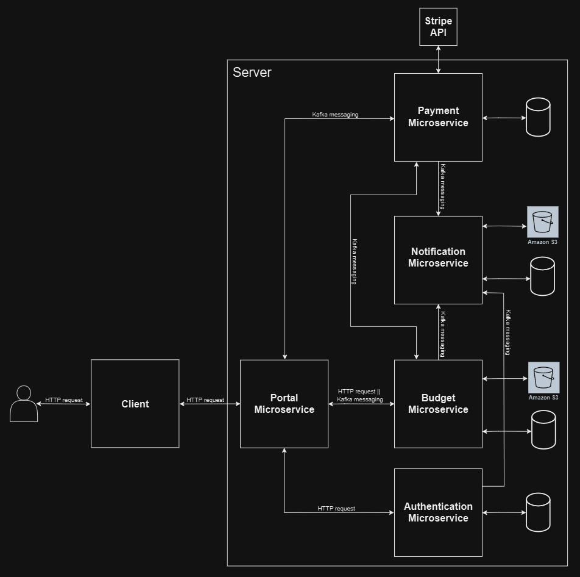
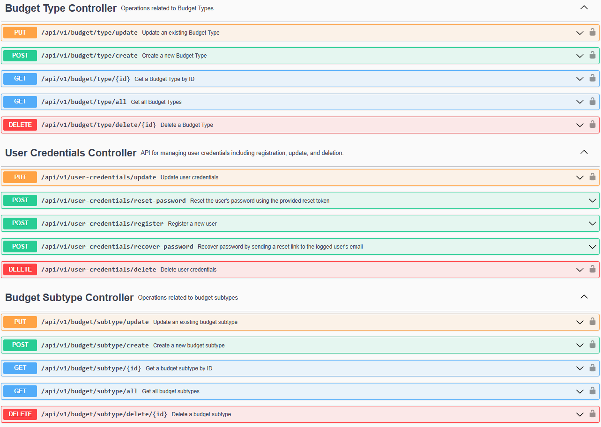
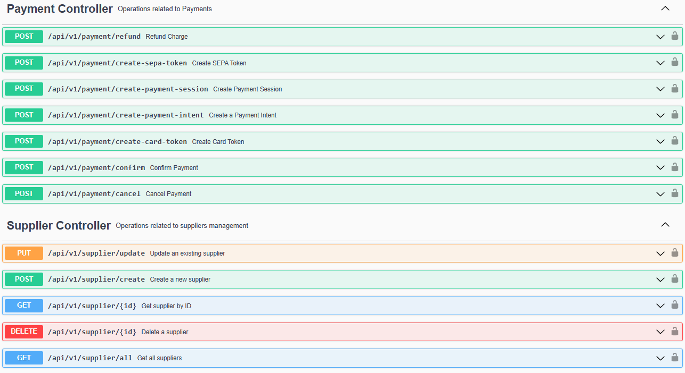
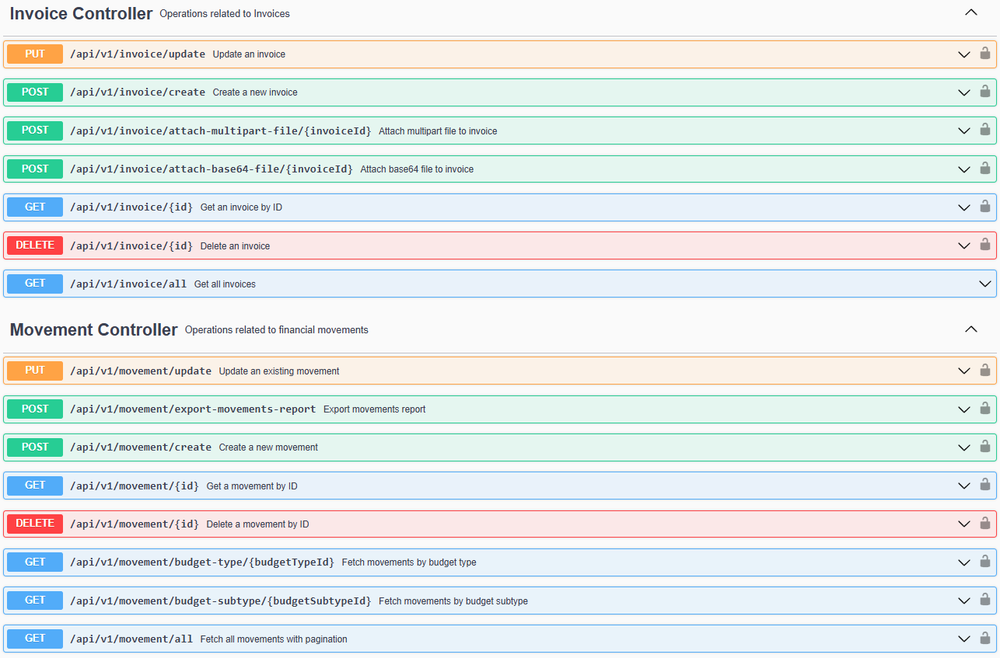
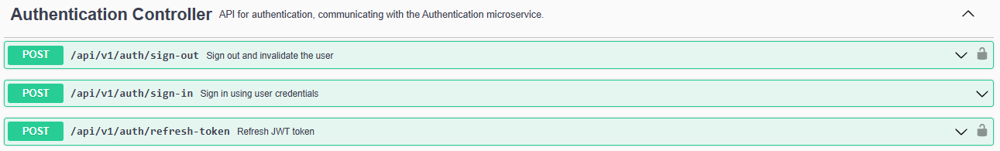

# BudgetHub

**BudgetHub** is a microservice-based financial management platform that helps businesses track expenses, manage budgets, and process payments. It provides a central portal for users to securely register, log in, and manage all financial activities. With easy integrations for expense tracking, payment processing, and notifications.

## Table of Contents

1. [Key Features](#key-features)
2. [Microservices Overview](#microservices-overview)
3. [Tech Stack](#tech-stack)
4. [Architecture](#architecture)
5. [Portal Microservice](#portal-microservice)
    - [Overview](#overview-1)
    - [Key Features](#key-features-1)
    - [Arquitecture](#architecture-1)
    - [Endpoints](#endpoints)
6. [Authentication Microservice](#authentication-microservice)
    - [Overview](#overview-2)
    - [Features](#features-1)
7. [Notification Microservice](#notification-microservice)
    - [Overview](#overview-3)
    - [Features](#features-2)
8. [Budget Microservice](#budget-microservice)
    - [Overview](#overview-4)
    - [Features](#features-3)
9. [Payment Microservice](#payment-microservice)
    - [Overview](#overview-5)
    - [Key Features](#key-features-2)

## Key Features

- **User Authentication**: Provides robust login and registration mechanisms with JWT token-based authentication to ensure secure user access across all services.
- **Budget Management**: Enables users to create, track, and manage various budget types and subtypes, suppliers, financial transactions, and invoices, ensuring real-time visibility into financial health.
- **Payment Processing**: Leverages Stripe for efficient and secure payment processing, including support for payment intents, refunds, and payment token management.
- **Notification System**: A dedicated service that manages and sends various notifications, including transactional emails, payment updates, and account alerts, with support for retries and persistent tracking.
- **Unified Service Access**: A centralized portal that serves as a single entry point for users to interact with the entire system, routing requests to the appropriate microservices seamlessly.

## Microservices Overview

1. **Portal Microservice**: The central gateway responsible for authenticating users, managing access control, and routing requests to the appropriate microservices within the system.
2. **Authentication Microservice**: Handles secure user authentication and management, including sign-up, login, password recovery, and JWT token issuance and validation.
3. **Budget Microservice**: Provides tools for organizing and managing financial budgets, including budget types, subtypes, movements (transactions), invoices, and supplier management. It includes built-in validation to prevent overspending and offers the ability to export movement reports in Excel format, which can be sent via email to users.
4. **Payment Microservice**: Integrates with Stripe to securely process payments, manage payment intents, cancellations, refunds, and handle payment tokens, ensuring efficient transaction handling.
5. **Notification Microservice**: Manages the creation and delivery of notifications, such as email alerts for payment confirmations, password resets, and transaction updates, with a system for tracking and retrying failed notifications.

## Tech Stack

- **Java 21**
- **Spring Boot 3**
- **Spring Data JPA**
- **Spring Security**
- **JSON Web Token (JWT)**
- **PostgreSQL**
- **Apache Kafka**
- **Spring Cloud OpenFeign**
- **Java Mail Sender**
- **AWS (S3)**
- **Stripe API**
- **Liquibase**
- **Docker**
- **Redis**
- **Mockito**
- **JUnit 5**
- **Gradle**
- **Lombok**
- **Swagger**
- **MapStruct**

## Architecture
BudgetHub follows a microservices architecture, with independent services communicating via Kafka or synchronous FeignClient calls. Each service is designed for scalability, reliability, and modularity.

---

# Portal Microservice

## Overview

The **Portal Microservice** is a comprehensive Spring Boot-based application that integrates with various components like **Stripe**, **Kafka**, **Redis**, and **email services** to provide a robust backend solution for managing financial and user operations. It supports functionalities such as payment handling, budget management, user authentication, email notifications, and reporting.

This service is designed to handle operations asynchronously using Kafka, ensuring scalability and responsiveness. It also leverages Redis for distributed locking and retries to handle failures gracefully.

## Key Features

### Payments and Stripe Integration
- **Payment Intent Creation**: Initiates payment intents on Stripe and sends responses via Kafka.
- **Payment Confirmation**: Handles payment intent confirmation, including retries for failed attempts.
- **Payment Cancellation**: Allows for canceling a payment intent when required.
- **Refunds**: Handles refunds for completed payments via Stripe.
- **Payment Token Creation**: Generates payment tokens for credit cards and SEPA direct debit payments.
- **Webhooks**: Listens to Stripe events like payment success, charge updates, and cancellations.
- **Invoice Management**: Issues invoices based on successful Stripe payments or refund events, and sends them via email to the corresponding user.
- **Retries**: Automatically retries failed payments based on configured retry policies.

### Financial Management
- **Budget Types**: Create, retrieve, update, and delete budget types. Budget types define the main categories for managing financial allocations.
- **Budget Subtypes**: Create, retrieve, update, and delete budget subtypes, representing specific areas within a budget type (e.g., "Marketing" under "Operational Costs").
- **Invoices**: Create, retrieve, update, and delete invoices associated with financial movements.
- **Movements**: Create, retrieve, update, and delete financial movements that track money allocated or spent under each budget type or subtype. Movements can be validated to ensure they don't exceed the allocated budget.
- **Suppliers**: Manage supplier data by adding, updating, and removing suppliers.
- **Movement Validation**: Validates movements to ensure they do not exceed the set budget limits for a given budget type or subtype.
- **Export Movements**: Exports movement data in Excel format, filtered by date and/or status, and sends the exported file via email to the logged user.
- **Attach Files to Invoices**: Allows attaching relevant files (e.g., receipts) to invoices for better documentation.

### Notifications
- **Send Email Notifications with Attachments**: Sends emails with optional attachments, such as exported reports or receipts.
- **Password Reset Notifications**: Sends password reset links via HTML-formatted emails.
- **Stripe Receipt Notifications**: Sends users a receipt link for completed payments on Stripe.
- **Failed Email Retry**: Automatically retries sending failed emails at scheduled intervals.
- **Distributed Locking**: Uses Redis to manage distributed locks, ensuring emails aren't retried simultaneously.

### User Management
- **Sign In**: Authenticate a user using their credentials (email and password) and return a JWT access token and refresh token.
- **Token Refresh**: Refresh the JWT access token using a valid refresh token.
- **Sign Out**: Logs out the user by clearing the security context.
- **User Registration**: Allows new users to register by providing user credentials.
- **User Credential Update**: Enables users to update their credentials.
- **Account Deletion**: Deletes an existing user account after verifying the credentials.
- **Password Recovery**: Allows users to receive a password reset link via email.
- **Password Reset**: Enables users to reset their password using a valid reset token.
- **User Status Check**: Retrieves the current login status (logged in or logged out) for a user.

## Architecture

The **Portal Microservice** is built with a microservices architecture, where each module interacts with Kafka topics for communication. Redis is used for distributed locking and retries, while Stripe handles payment processing. Each operation uses unique `correlationId`s for seamless asynchronous request-response flows.

## Endpoints

---

# Authentication Microservice

## Overview

The **Authentication Microservice** is designed to handle user authentication, token management, and user credential management functionalities. This service includes endpoints for signing in, refreshing JWT tokens, signing out users, and managing user credentials like registration, updating, and deleting user accounts. Additionally, it provides endpoints for password recovery and reset.

The service is built using Spring Boot with JWT-based authentication and is designed to be stateless. It interacts with a user credentials repository and supports functionalities like password encryption, token generation, and refresh, ensuring secure and reliable authentication mechanisms.

## Features

- **Sign In**: Authenticate a user using their credentials (email and password) and return a JWT access token and refresh token.
- **Token Refresh**: Refresh the JWT access token using a valid refresh token.
- **Sign Out**: Logs out the user by clearing the security context.
- **User Registration**: Allows new users to register by providing user credentials.
- **User Credential Update**: Allows users to update their credentials.
- **Account Deletion**: Deletes an existing user account after verifying the credentials.
- **Password Recovery**: Allows users to recover their password by receiving a reset link in the email.
- **Password Reset**: Allows users to reset their password using a valid reset token.
- **User Status Check**: Retrieves the current login status (logged in or logged out) for a user.

---

# Notification Microservice

## Overview

The **Notification Microservice** is designed to manage email notifications within a distributed system. It handles the sending of various types of email notifications, including export reports, password reset requests, and Stripe receipt notifications. The service integrates with Kafka for asynchronous message handling, Redis for distributed locking, and utilizes Spring Boot for microservice architecture.

This microservice ensures reliable and scalable delivery of email notifications, retries failed email attempts, and supports email attachments.

## Features

- **Send Email Notification with Attachment**: Handles email notifications with an optional attachment, such as export reports.
- **Password Reset Notifications**: Sends email notifications for password reset requests, including HTML-formatted content with reset links.
- **Stripe Receipt Notifications**: Sends email notifications with a link to the user's receipt from Stripe.
- **Failed Email Retry**: Automatically retries sending failed emails at scheduled intervals.
- **Distributed Locking**: Uses Redis for managing distributed locks to avoid simultaneous retries of failed emails.

---

# Budget Microservice

## Overview

The **Budget Microservice** is designed to handle all operations related to budgets, including the management of budget types, subtypes, invoices, movements, and suppliers. It enables users to manage budget allocations, track expenses, validate movements, and generate reports. Additionally, it supports exporting movements as Excel files, based on date or status filters, and emailing the exports to users. This service is built using Spring Boot, Kafka for event-driven architecture, and integrates with various data repositories for budget management.

The **Budget Microservice** ensures seamless data flow and scalability by utilizing asynchronous communication through Kafka or synchronous communication through FeignClient, along with reliable data validation for maintaining budget constraints.

## Features

- **Budget Types**: Create, retrieve, update, and delete budget types. Budget types define the main categories for managing financial allocations.
- **Budget Subtypes**: Create, retrieve, update, and delete budget subtypes. These represent specific categories or areas within a budget type (e.g., "Marketing" under "Operational Costs").
- **Invoices**: Create, retrieve, update, and delete invoices, which are associated with movements.
- **Movements**: Create, retrieve, update, and delete financial movements that track money allocated or spent under each budget type or subtype. Movements can be validated to ensure they don't exceed the allocated budget.
- **Suppliers**: Add, update, and remove suppliers. Suppliers are critical for associating financial transactions with the entities that provide goods or services.
- **Movement Validation**: Validate movements to ensure they do not exceed the set budget limits for a given budget type or subtype.
- **Export Movements**: Allows exporting movements data in Excel format, filtered by date and/or status, and sending the exported file via email to the logged user.
- **Attach Files to Invoices**: Allows attaching relevant files (e.g., receipts) to invoices for better documentation.

---

# Payment Microservice

## Overview

The **Payment Microservice** is a Spring Boot-based service that integrates with Stripe for handling payments, including creating payment intents, canceling and confirming payments, issuing refunds, and managing payment tokens. This service listens to various Kafka topics to handle different payment actions such as payment creation, confirmation, and refund requests.

Additionally, it provides webhook handling to interact with Stripe's real-time event notifications.

### Key Features

- **Payment Intent Creation**: Initiates payment intents on Stripe and sends responses via Kafka.
- **Payment Confirmation**: Handles payment intent confirmation, including retries for failed attempts.
- **Payment Cancellation**: Allows for canceling a payment intent when required.
- **Refunds**: Handles refunds for completed payments via Stripe.
- **Payment Token Creation**: Generates payment tokens for credit cards and SEPA direct debit payments.
- **Webhooks**: Listens to Stripe events like payment success, charge updates, and cancellations.
- **Invoice Management**: Issues invoices based on successful Stripe payments or refund events, and sends them via email to the corresponding user.
- **Retries**: Automatically retries failed payments based on configured retry policies.
