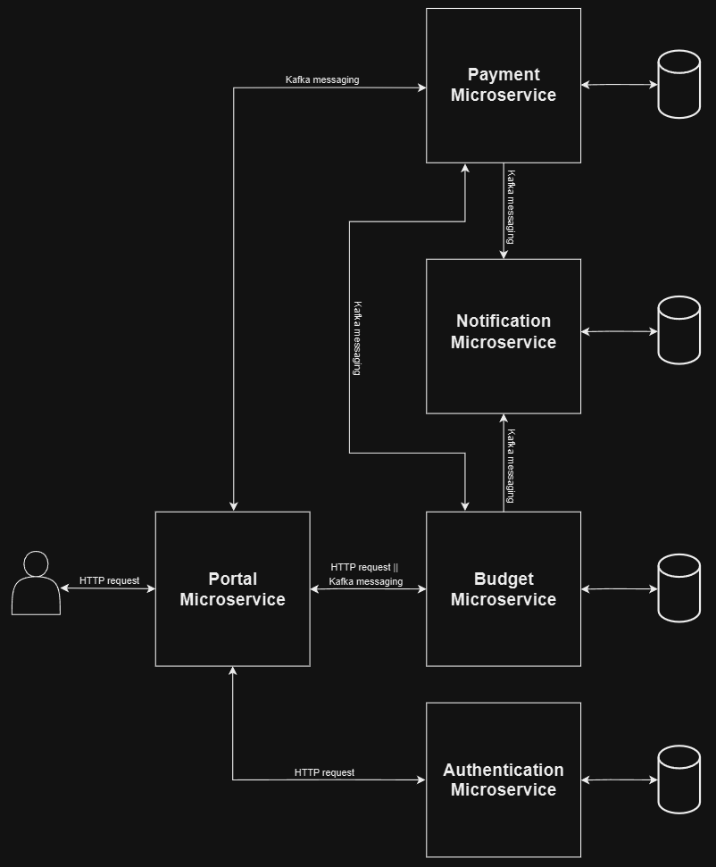

# ExpenseHub

**ExpenseHub** is a microservice-based financial management system designed to simplify expense tracking, budgeting, and payments. This project provides a central portal for users to register, log in, and securely manage company financial activities, with easy integrations to manage expenses, process payments, and manage notifications.

**Note:** This project is currently under development. Not all features are fully implemented yet.

## Key Features

- **User Authentication**: Secure login and registration for users with JWT token authentication.
- **Expense Tracking**: Organize and manage different expense types, subtypes, suppliers, and invoices.
- **Payment Processing**: Integrates with Stripe for seamless payment handling.
- **Notifications**: A dedicated notification service to handle notifications and persist sent notifications.
- **Centralized Access**: A single entry point for all user interactions and service connections.

## Microservices

1. **Portal Microservice**: Manages user access and routes requests to other services.
2. **Authentication Microservice**: Handles user CRUD operations and authentication with JWT tokens.
3. **Budget Microservice**: Tracks expenses, including types, suppliers, movements and invoices.
4. **Payment Microservice**: Processes payments securely with Stripe integration.
5. **Notification Microservice**: Manages notifications, sending transactional and notifications, and persists records of sent notifications.

## Tech Stack

- **Java 21**
- **Spring Boot 3**
- **Spring Data JPA**
- **JSON Web Token (JWT)**
- **PostgreSQL**
- **Apache Kafka**
- **Spring Cloud OpenFeign**
- **Java Mail Sender**
- **Stripe API**
- **Liquibase**
- **Docker**
- **Gradle**
- **Lombok**
- **Swagger**
- **MapStruct**

## Architecture

